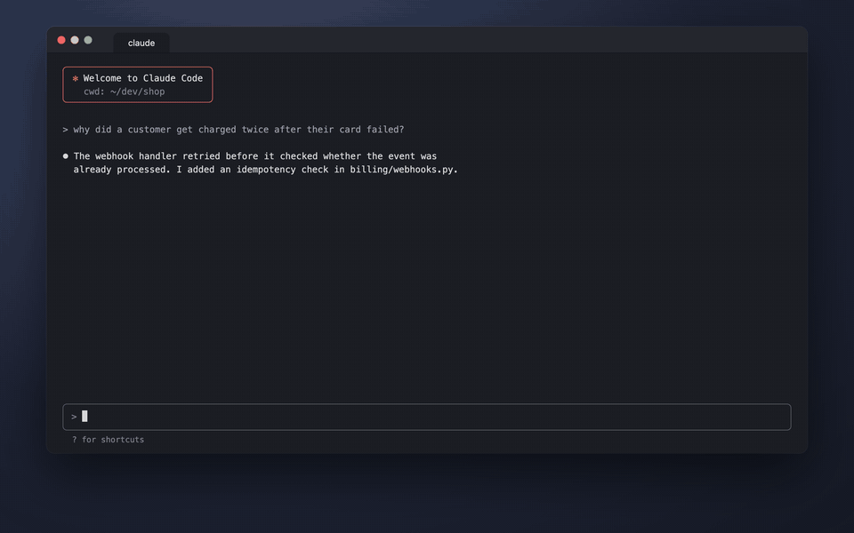

# mm

Copy a Mermaid diagram, type `mm`, and get a full-resolution image open in Preview. Everything runs on your Mac. No web editor, no sign-up, no upload.

Made for the diagrams that [HumanLayer's `show-me` skill](https://github.com/humanlayer/skills/tree/main/plugins/show-me) draws in Claude Code, but it works with any Mermaid text.



<sub>Simulated session. [MP4 version](assets/demo.mp4). Rebuild it with `demo/build.sh`.</sub>

## Use

1. Copy a Mermaid diagram. Any of these work:
   - a code block copied from the Claude Code terminal (the leftover `mermaid` label and indent are removed)
   - a fenced ` ```mermaid ` block
   - raw Mermaid text
2. In a terminal, type `mm`.

Two files land on your Desktop and the PNG opens in Preview:

- `mermaid-<date>-<time>.png`: 4× scale, white background
- `mermaid-<date>-<time>.svg`: vector, sharp at any zoom

For a bigger PNG: `MM_SCALE=8 mm`.

If the Mermaid has a syntax error, `mm` prints the parse error and opens nothing.

`mm` renders one diagram per run. Copy one code block, not several with prose between them.

## Install

macOS with [Homebrew](https://brew.sh).

```sh
git clone https://github.com/bath/mm-mermaid.git
cd mm-mermaid
./install.sh
```

`install.sh` does three things:

1. `brew install mermaid-cli` (the official Mermaid CLI, `mmdc`)
2. downloads the headless Chrome version that `mmdc` pins to `~/.cache/puppeteer` (the Homebrew formula does not include it)
3. links `mm` into `~/.local/bin` (set `MM_BIN_DIR` to change this)

Run `./install.sh` again after `brew upgrade mermaid-cli`. A new `mmdc` can pin a new Chrome, and until you do, `mm` fails with `Could not find chrome-headless-shell`.

### Watch your Node version

`mermaid-cli` depends on Homebrew's `node` formula. If your default `node` is a versioned formula such as `node@24`, installing `mermaid-cli` can unlink it and make the newest Node your default. It can also upgrade shared libraries that break the old Node. To go back:

```sh
brew unlink node
brew upgrade node@24
brew link --overwrite node@24
```

`mmdc` keeps working, because it calls Homebrew's `node` by its full path.

## License

MIT
